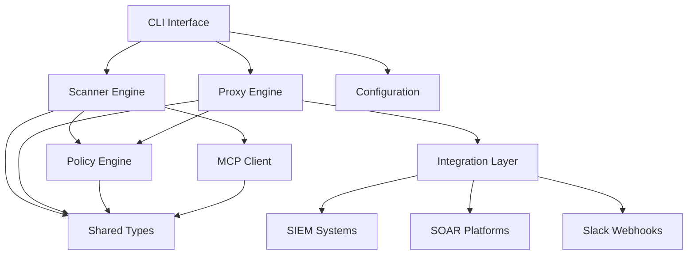

# Architecture Overview

This document provides a overview of the MCP Security Scanner architecture, component relationships, and design principles.

## System Architecture

### High-Level Architecture

```
┌─────────────────────────────────────────────────────────────────┐
│                         MCP Security Scanner                    │
├─────────────────────────────────────────────────────────────────┤
│  CLI Interface (cmd/mcpscan)                                   │
│  ├─ Command parsing and validation                             │
│  ├─ Configuration loading                                      │
│  └─ Result formatting and output                               │
├─────────────────────────────────────────────────────────────────┤
│  Core Engines                                                  │
│  ├─ Scanner Engine (internal/scanner)                          │
│  │  ├─ Static analysis                                         │
│  │  ├─ Dynamic vulnerability testing                           │
│  │  ├─ Advanced pattern detection (polymorphic)                │
│  │  │  ├─ Weighted pattern variants with context analysis      │
│  │  │  ├─ Performance-optimized pattern caching (55% faster)   │
│  │  │  ├─ Parallel processing with worker pools               │
│  │  │  ├─ Advanced false positive filtering                   │
│  │  │  ├─ Confidence scoring and entropy analysis             │
│  │  │  └─ Thread-safe compiled regex storage                  │
│  │  ├─ MCP-specific vulnerability testing                      │
│  │  └─ Risk assessment and scoring                             │
│  │                                                             │
│  ├─ Proxy Engine (internal/proxy)                              │
│  │  ├─ HTTP/WebSocket traffic interception                     │
│  │  ├─ Real-time security analysis                             │
│  │  ├─ Pattern-based threat detection                          │
│  │  ├─ Request/response modification                           │
│  │  ├─ WebSocket bidirectional analysis                        │
│  │  ├─ Performance monitoring and metrics                      │
│  │  └─ Security alert generation and logging                   │
│  │                                                             │
│  └─ Policy Engine (internal/policy)                            │
│     ├─ JSON policy loading                                     │
│     ├─ Rule validation                                         │
│     └─ Pattern matching                                        │
├─────────────────────────────────────────────────────────────────┤
│  Protocol Layer (internal/mcp)                                 │
│  ├─ MCP message parsing                                        │
│  ├─ JSONRPC 2.0 handling                                       │
│  └─ Server capability discovery                                │
├─────────────────────────────────────────────────────────────────┤
│  Integration Layer (internal/integration)                      │
│  ├─ SIEM/SOAR connectors                                       │
│  ├─ Slack notifications                                        │
│  └─ Alert forwarding                                           │
└─────────────────────────────────────────────────────────────────┘
```

### Component Relationships



## Core Components

### 1. Command Line Interface (cmd/mcpscan)

**Purpose**: Provides the primary user interface for all scanner operations.

**Key Responsibilities**:
- Command parsing and validation
- Configuration file loading
- Scanner and proxy initialisation
- Result formatting and output
- Error handling and user feedback

**Main Functions**:
```go
func main()                    // Entry point and command routing
func runScanLocal()           // Local filesystem scanning
func runScanRemote()          // Remote MCP server scanning
func runProxy()               // Proxy mode with traffic analysis
func loadConfiguration()      // Configuration management
```

#### Scanner Engine Components

**Core Scanner (scanner.go)**
- Primary vulnerability scanning orchestrator
- Policy engine integration and rule application
- Risk calculation and assessment logic
- Multi-format report generation (HTML, PDF, JSON, text)

**Advanced Pattern Detection (advanced_patterns.go)**
- Polymorphic attack pattern recognition using scoring algorithms
- Behavioral analysis for detecting anomalous MCP interactions
- Supply chain security assessment for dependency vulnerabilities
- Zero-day pattern detection using heuristic analysis
- Evidence collection and multi-stage threat correlation

**MCP-Specific Vulnerability Testing (mcp_vulnerabilities.go)**
- Tool poisoning attack simulation and detection
- Resource manipulation and unauthorised access testing
- Context poisoning through malicious prompt injection
- URI manipulation and directory traversal in MCP resources
- Protocol abuse detection for MCP message tampering

**Security Policy Engine**
- Dynamic policy loading from JSON configuration files
- Rule-based pattern matching with regex compilation
- Severity classification and risk threshold management
- Multi-policy support for different security requirements

**Architecture**:
```go
// Main scanner struct
type Scanner struct {
    config     Config
    policies   []SecurityPolicy
    mcpClient  *mcp.Client
    httpClient *http.Client
}

// Core scanning methods
func (s *Scanner) ScanLocal(target string) (*ScanResult, error)
func (s *Scanner) ScanRemote(target string) (*ScanResult, error)
func (s *Scanner) analyseVulnerabilities(findings []Finding) RiskLevel
```

**Vulnerability Detection Flow**:
1. **Discovery Phase**: Enumerate MCP capabilities (tools/resources)
2. **Static Analysis**: Pattern matching against security policies
3. **Dynamic Testing**: Injection testing and authentication bypass
4. **Configuration Analysis**: Security configuration assessment
5. **Risk Scoring**: Aggregate findings and calculate risk levels

### 3. Proxy Engine (internal/proxy)

**Purpose**: Real-time MCP traffic interception and security monitoring.

**Key Responsibilities**:
- HTTP and WebSocket traffic proxying
- Real-time pattern analysis
- Suspicious activity detection
- Alert generation and forwarding
- Performance monitoring

**Architecture**:
```go
type Proxy struct {
    target       string
    bindAddr     string
    policies     []SecurityPolicy
    alertChan    chan Alert
    httpProxy    *httputil.ReverseProxy
    wsUpgrader   websocket.Upgrader
}

// Core proxy methods
func (p *Proxy) Start() error
func (p *Proxy) handleHTTP(w http.ResponseWriter, r *http.Request)
func (p *Proxy) handleWebSocket(w http.ResponseWriter, r *http.Request)
func (p *Proxy) analyseTraffic(data []byte) []Alert
```

**Traffic Analysis Pipeline**:
1. **Interception**: Capture HTTP/WebSocket traffic
2. **Parsing**: Extract MCP messages from traffic
3. **Analysis**: Pattern matching against security policies
4. **Decision**: Allow, block, or alert on suspicious patterns
5. **Logging**: Record security events for audit

### 4. Policy Engine (internal/policy)

**Purpose**: Security policy management and rule evaluation.

**Key Responsibilities**:
- JSON policy file loading and validation
- Security rule compilation and indexing
- Pattern matching execution
- Policy inheritance and merging
- Risk threshold management

**Architecture**:
```go
type PolicyEngine struct {
    policies    map[string]SecurityPolicy
    compiledRules map[string]*regexp.Regexp
    directory   string
}

// Policy management methods
func (pe *PolicyEngine) LoadPolicies(dir string) error
func (pe *PolicyEngine) ValidatePolicy(policy SecurityPolicy) error
func (pe *PolicyEngine) EvaluatePatterns(content string, rules []SecurityRule) []Finding
```

**Policy Structure**:
```json
{
  "policy_name": "critical-security",
  "version": "1.0",
  "description": "Critical security patterns",
  "rules": [
    {
      "id": "INJECTION_001",
      "name": "Command Injection",
      "patterns": ["exec\\s*\\(", "system\\s*\\("],
      "severity": "Critical"
    }
  ],
  "blocked_patterns": ["rm -rf", "DROP TABLE"],
  "risk_thresholds": {
    "critical": 50,
    "high": 30,
    "medium": 15,
    "low": 5
  }
}
```

### Security Policy Framework

The MCP Security Scanner implements a  multi-policy security framework designed to address diverse threat landscapes and organisational requirements:

#### Available Security Policies

1. **Critical Security Policy** (`critical-security.json`)
   - **Purpose**: Enterprise-grade threat detection for production environments
   - **Scope**: High-sensitivity pattern matching with strict security controls
   - **Rule Count**: 50+ critical vulnerability patterns
   - **Use Cases**: Production deployments, financial services, healthcare systems

2. **Standard Security Policy** (`standard-security.json`)
   - **Purpose**: Balanced security assessment for general development workflows
   - **Scope**: Common vulnerability patterns and industry best practices
   - **Rule Count**: Standard security checks
   - **Use Cases**: Development environments, CI/CD pipelines, general security audits

3. **MCP Advanced Security Policy** (`mcp-advanced-security.json`)
   - **Purpose**: Cutting-edge threat detection with advanced pattern recognition
   - **Scope**: 159+ sophisticated detection rules covering emerging attack vectors
   - **Capabilities**: 
     - Polymorphic attack pattern recognition
     - Behavioral analysis and anomaly detection
     - MCP protocol-specific attack vectors (tool poisoning, resource manipulation)
     - Zero-day pattern detection using heuristic analysis
   - **Use Cases**: Advanced threat hunting, research environments, high-security deployments

4. **Custom Policy Template** (`org-custom-template.json`)
   - **Purpose**: Customisable security framework template for organisation-specific requirements
   - **Scope**: Template for data protection, compliance patterns, internal security standards
   - **Features**: Example patterns and configurable risk thresholds for customisation
   - **Use Cases**: Starting point for regulatory compliance, custom security requirements, internal governance

#### Policy Selection Strategy

```go
// Policy selection examples
func selectPolicyForEnvironment(env string) string {
    switch env {
    case "production":
        return "critical-security"
    case "development", "staging":
        return "standard-security"
    case "research", "advanced-threat-hunting":
        return "mcp-advanced-security"
    case "compliance", "internal-audit":
        return "your-custom-policy"  // Create from org-custom-template
    default:
        return "standard-security"
    }
}
```

#### Advanced Polymorphic Pattern Architecture

**Polymorphic Detection Engine**: Introduced in version 1.1.0, enables policy-driven detection of sophisticated attack patterns that adapt to evade traditional signature-based detection.

**Core Components**:

```go
// SecurityPolicy structure
type SecurityPolicy struct {
    Version             string               `json:"version"`
    PolicyName          string               `json:"policyName"`
    Rules               []SecurityRule       `json:"rules"`
    PolymorphicPatterns []PolymorphicPattern `json:"polymorphicPatterns,omitempty"`
    BehavioralPatterns  []BehavioralPattern  `json:"behavioralPatterns,omitempty"`
    RiskThresholds      RiskThresholds       `json:"riskThresholds"`
}

type PolymorphicPattern struct {
    Name        string   `json:"name"`
    Description string   `json:"description"`
    Severity    string   `json:"severity"`
    Category    string   `json:"category"`
    Variants    []string `json:"variants"`    // Multiple attack variations
    Threshold   int      `json:"threshold"`   // Minimum matches required
}

type BehavioralPattern struct {
    Name        string   `json:"name"`
    Description string   `json:"description"`
    Severity    string   `json:"severity"`
    Category    string   `json:"category"`
    Patterns    []string `json:"patterns"`
    Threshold   int      `json:"threshold"`   // Minimum pattern matches
}
```

**Detection Algorithm**:
1. **Variant Enumeration**: Load polymorphic pattern variants from policy
2. **Multi-Pattern Matching**: Apply all variants against target content
3. **Score Calculation**: Count successful variant matches
4. **Threshold Evaluation**: Compare score against pattern threshold
5. **Evidence Aggregation**: Collect matched variants as evidence
6. **Finding Generation**: Create findings for patterns exceeding threshold

**Example Policy Configuration**:
```json
{
  "polymorphicPatterns": [
    {
      "name": "command_injection_variants",
      "threshold": 2,
      "variants": [
        "exec\\s*\\(\\s*[\"'].*[\"']",
        "system\\s*\\(\\s*[\"'].*[\"']", 
        "eval\\s*\\(\\s*[\"'].*exec.*[\"']",
        "__import__\\s*\\(\\s*[\"']os[\"']"
      ]
    }
  ]
}
```

**Benefits**:
- **Adaptive Detection**: Patterns automatically adapt to new attack variations
- **Reduced False Positives**: Threshold-based detection reduces noise
- **Policy-Driven**: No code changes required for new attack patterns
- **Evidence Collection**: Evidence gathering for forensic analysis
```

### 5. MCP Protocol Layer (internal/mcp)

**Purpose**: Native MCP protocol implementation and server communication.

**Key Responsibilities**:
- JSONRPC 2.0 message handling
- MCP protocol version compliance
- Server capability discovery
- Tool and resource enumeration
- Connection management

**Architecture**:
```go
type Client struct {
    baseURL    string
    httpClient *http.Client
    wsConn     *websocket.Conn
    timeout    time.Duration
}

// MCP protocol methods
func (c *Client) Initialize() error
func (c *Client) ListTools() ([]Tool, error)
func (c *Client) ListResources() ([]Resource, error)
func (c *Client) CallTool(name string, args map[string]interface{}) (*ToolResult, error)
```

**MCP Message Flow**:
1. **Initialisation**: Establish connection and protocol version
2. **Capability Discovery**: Enumerate available tools and resources
3. **Security Testing**: Inject test payloads into discovered endpoints
4. **Analysis**: Evaluate responses for security indicators

## Data Flow Architecture

### Scanning Data Flow

```
Target → Discovery → Static Analysis → Dynamic Testing → Risk Assessment → Report
   ↓         ↓            ↓                ↓               ↓             ↓
 MCP       Tools/       Pattern          Injection      Severity      JSON
Server   Resources    Matching          Testing        Scoring      Output
```

### Proxy Data Flow

```
Client → Proxy → Target Server
  ↑        ↓         ↓
Alert ← Analysis ← Response
  ↓
SIEM/SOAR
```

### Policy Evaluation Flow

```
Content → Pattern Matching → Rule Evaluation → Risk Calculation → Finding
    ↓            ↓                ↓               ↓             ↓
 Source      Regex Patterns   Security Rules   Severity    Structured
  Code       from Policies     Triggered       Weights      Results
```

## Security Design Principles

### 1. Defence in Depth
- Multiple layers of security analysis
- Static and dynamic testing approaches
- Real-time monitoring capabilities
- Policy framework

### 2. Fail-Safe Defaults
- Block suspicious traffic by default in proxy mode
- Conservative risk scoring (favour false positives over false negatives)
- Secure configuration defaults

### 3. Principle of Least Privilege
- Minimal required permissions for operation
- Sandboxed execution environment support
- Configurable access controls

### 4. Zero Trust Architecture
- All MCP traffic considered potentially malicious
- Continuous verification and monitoring
- No implicit trust relationships

## Performance Considerations

### Scalability Design
- Concurrent scanning capabilities using goroutines
- Streaming analysis for large datasets
- Configurable resource limits and timeouts
- Memory-efficient pattern matching

### Optimisation Strategies
- Compiled regex patterns for performance
- Connection pooling for remote scanning
- Efficient JSON parsing and serialisation
- Asynchronous alert processing

### Resource Management
- Configurable memory limits
- CPU usage monitoring
- Network bandwidth considerations
- Disk space management for logs

## Extension Points

### 1. Custom Security Rules
- JSON-based policy definition
- Regex pattern support
- Severity level customisation
- Organisational policy inheritance

### 2. Integration Interfaces
- SIEM/SOAR webhook support
- REST API endpoints
- Custom alert formatting
- Metric collection interfaces

### 3. Protocol Extensions
- Additional MCP protocol versions
- Custom message types
- Capability discovery
- Extended security metadata

## Live Monitoring Proxy Architecture

### Proxy Design Overview

The Live Monitoring Proxy implements a transparent security gateway pattern, providing real-time threat detection and response for MCP communications.

```
┌─────────────────┐    ┌─────────────────────────────────────────┐    ┌─────────────────┐
│   MCP Client    │───▶│          MCP Security Proxy             │───▶│   MCP Server    │
│                 │    │                                         │    │                 │
│ - Desktop Apps  │    │ ┌─────────────────────────────────────┐ │    │ - AI Services   │
│ - Web Clients   │    │ │     Traffic Interceptor             │ │    │ - Tool Servers  │
│ - CLI Tools     │    │ │ - HTTP Reverse Proxy                │ │    │ - Resource APIs │
│ - SDKs          │    │ │ - WebSocket Upgrader                │ │    │ - Chat APIs     │
└─────────────────┘    │ │ - Request/Response Modification     │ │    └─────────────────┘
                       │ └─────────────────────────────────────┘ │
                       │                   │                     │
                       │                   ▼                     │
                       │ ┌─────────────────────────────────────┐ │
                       │ │     Security Analysis Engine       │ │
                       │ │ - Policy-based Pattern Matching    │ │
                       │ │ - Real-time Threat Detection       │ │
                       │ │ - MCP Protocol-aware Analysis      │ │
                       │ │ - Behavioral Anomaly Detection     │ │
                       │ └─────────────────────────────────────┘ │
                       │                   │                     │
                       │                   ▼                     │
                       │ ┌─────────────────────────────────────┐ │
                       │ │     Event Management System        │ │
                       │ │ - Alert Generation & Queuing       │ │
                       │ │ - Structured Logging                │ │
                       │ │ - Performance Metrics Collection    │ │
                       │ │ - SIEM Integration                  │ │
                       │ └─────────────────────────────────────┘ │
                       └─────────────────────────────────────────┘
                                           │
                                           ▼
                       ┌─────────────────────────────────────────┐
                       │        Monitoring Interface             │
                       │                                         │
                       │ - RESTful API Endpoints                 │
                       │   ├─ /monitor/health                    │
                       │   ├─ /monitor/alerts                    │
                       │   └─ /monitor/logs                      │
                       │                                         │
                       │ - Real-time Status Dashboard           │
                       │ - Performance Metrics Exposure         │
                       │ - Security Event Streaming             │
                       └─────────────────────────────────────────┘
```

### Proxy Component Details

#### 1. Traffic Interceptor

**HTTP Reverse Proxy:**
```go
// Uses Go's httputil.NewSingleHostReverseProxy
proxy := httputil.NewSingleHostReverseProxy(targetURL)

// Custom Director for request modification
proxy.Director = func(req *http.Request) {
    originalDirector(req)
    req.Host = p.target.Host
    req.URL.Scheme = p.target.Scheme
    req.URL.Host = p.target.Host
}

// Response modification for analysis
proxy.ModifyResponse = func(resp *http.Response) error {
    // Analyse response content
    // Log transaction details
    // Generate alerts if needed
}
```

**WebSocket Handler:**
```go
// Upgrades HTTP connections to WebSocket
upgrader := websocket.Upgrader{
    CheckOrigin: func(r *http.Request) bool { return true },
}

// Bidirectional message analysis
go func() {
    for {
        messageType, data, err := clientConn.ReadMessage()
        if err != nil { break }
        
        // Analyse WebSocket message
        p.analyzeWebSocketMessage(data)
        
        // Forward to target server
        err = serverConn.WriteMessage(messageType, data)
    }
}()
```

#### 2. Security Analysis Engine

**Pattern Matching System:**
```go
type SecurityAnalyzer struct {
    policies    map[string]*SecurityPolicy
    patterns    []*regexp.Regexp
    blocklist   map[string]bool
    thresholds  map[string]int
}

func (sa *SecurityAnalyzer) AnalyzeRequest(req *MCPMessage) []SecurityAlert {
    var alerts []SecurityAlert
    
    // Check against all policy patterns
    for _, policy := range sa.policies {
        for _, rule := range policy.Rules {
            if sa.matchesPattern(req, rule.Patterns) {
                alert := SecurityAlert{
                    Severity:    rule.Severity,
                    RuleID:      rule.ID,
                    Evidence:    extractEvidence(req, rule),
                    Timestamp:   time.Now(),
                }
                alerts = append(alerts, alert)
            }
        }
    }
    
    return alerts
}
```

**Real-time Detection:**
- **SQL Injection**: Pattern matching for SQL syntax in parameters
- **Command Injection**: Detection of shell command patterns
- **Path Traversal**: Directory traversal pattern recognition
- **Tool Poisoning**: MCP-specific attack pattern detection
- **Resource Manipulation**: Malicious URI and content detection

#### 3. Event Management System

**Alert Processing:**
```go
func (p *Proxy) processAlerts() {
    for alert := range p.alertChan {
        // Log alert with full context
        p.logSecurityAlert(alert)
        
        // Forward to SIEM if configured
        if p.config.SIEM.Enabled {
            p.forwardToSIEM(alert)
        }
        
        // Send Slack notification for high severity
        if alert.Severity == "High" || alert.Severity == "Critical" {
            p.sendSlackAlert(alert)
        }
        
        // Store in alert queue for API access
        p.alertQueue = append(p.alertQueue, alert)
    }
}
```

**Performance Monitoring:**
```go
type ProxyMetrics struct {
    RequestsProcessed   int64         `json:"requests_processed"`
    RequestsBlocked     int64         `json:"requests_blocked"`
    AverageResponseTime time.Duration `json:"average_response_time"`
    ErrorRate          float64       `json:"error_rate"`
    AlertsGenerated    int64         `json:"alerts_generated"`
    Uptime             time.Duration `json:"uptime"`
}
```

### Proxy Data Flow

```
1. Client Request
   ↓
2. Traffic Interceptor receives request
   ↓
3. Request body extraction and parsing
   ↓
4. Security Analysis Engine processes request
   ├─ Pattern matching against security policies
   ├─ Behavioral analysis for anomalies
   └─ Risk scoring and alert generation
   ↓
5. Decision Engine determines action
   ├─ Block request (if threat detected)
   ├─ Modify request (if sanitization possible)
   └─ Forward request (if legitimate)
   ↓
6. Forward to target MCP server
   ↓
7. Response Analysis
   ├─ Content analysis for data leakage
   ├─ Error message sanitization
   └─ Response time monitoring
   ↓
8. Return response to client
   ↓
9. Event Logging and Alert Processing
   ├─ Generate security logs
   ├─ Update performance metrics
   ├─ Queue alerts for monitoring API
   └─ Forward events to SIEM/SOAR
```

### Proxy Security Features

#### 1. Threat Detection Capabilities

**Injection Attacks:**
- SQL injection pattern recognition
- NoSQL injection detection
- Command injection identification
- LDAP injection patterns
- XML/JSON injection detection

**Protocol Abuse:**
- MCP message structure validation
- Tool parameter manipulation detection
- Resource URI tampering identification
- Capability enumeration abuse detection

**Behavioral Analysis:**
- Request rate anomaly detection
- Parameter pattern analysis
- Response time anomaly identification
- Data volume monitoring

#### 2. Real-time Response

**Blocking Actions:**
```yaml
blockingRules:
  - pattern: "drop\\s+table"
    action: "block"
    response: '{"error": "Request blocked by security policy", "code": 403}'
    
  - pattern: "rm\\s+-rf"
    action: "block" 
    response: '{"error": "Malicious command detected", "code": 403}'
    
  - pattern: "\\.\\./"
    action: "sanitize"
    replacement: ""
```

**Alert Severity Actions:**
```yaml
severityActions:
  Critical:
    - block_request
    - log_incident
    - alert_siem
    - notify_admin
    
  High:
    - block_request
    - log_incident
    - alert_siem
    
  Medium:
    - log_incident
    - alert_siem
    
  Low:
    - log_incident
```

### Deployment Architectures

### Standalone Deployment
```
Scanner CLI → Target MCP Server
```

### Proxy Deployment
```
MCP Client → Scanner Proxy → Target MCP Server
               ↓
           SIEM/SOAR
```

### Enterprise Deployment
```
Multiple Clients → Load Balancer → Scanner Proxies → Target Servers
                        ↓               ↓
                   Management      SIEM/SOAR
                    Dashboard      Integration
```

This architecture provides a robust, scalable foundation for MCP security assessment while maintaining flexibility for diverse deployment scenarios and security requirements.
